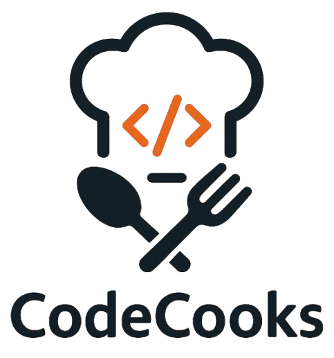

<a id="readme-top"></a>

<div align="center">


</div>

<!-- PROJECT LOGO -->
<br />
<div align="center">
    <div style="background-color: white; border-radius: 50%; width: 120px; height: 120px; display: flex; align-items: center; justify-content: center;">
        
    </div>
    <h3 align="center">CodeCooks</h3>

  <p align="center">
    A full-stack recipe sharing platform for home chefs, foodies, and aspiring cooks,
    <br />
    and a CSE264 final project!
    <br />
  </p>
</div>

<div align="center">

[![Next][Next.js]][Next-url]
[![React][React.js]][React-url]
[![TailwindCSS][TailwindCSS]][TailwindCSS-url]
[![PostgreSQL][PostgreSQL]][PostgreSQL-url]

</div>


<!-- TABLE OF CONTENTS -->
<details>
  <summary>Table of Contents</summary>
  <ol>
    <li>
      <a href="#about-the-project">About the project</a>
      <ul>
        <li><a href="#key-features">Key features</a></li>
      </ul>
    </li>
    <li>
      <a href="#getting-started">Getting Started</a>
    </li>
    <li><a href="#roadmap">Roadmap</a></li>
    <li><a href="#contributors">Contributors</a></li>
    <li><a href="#license">License</a></li>
    <li><a href="#acknowledgments">Acknowledgments</a></li>
  </ol>
</details>

<!-- ABOUT THE PROJECT -->
## About The Project

[![Website Screenshot 1][website-screenshot-1]](#todo)
[![Website Screenshot 2][website-screenshot-2]](#todo)

CodeCooks is a dynamic recipe-sharing web application built with Next.js, designed for users to create, browse, favorite, and manage recipes. It supports authentication, role-based authorization, and showcases recipes in an engaging, interactive way. External API integration also allows users to explore a surprise recipe each day.

### Key features
* <b>User Accounts & Roles</b> - users vs. admin
* <b>Social element</b> - in addition to creating and deleting recipes, authenticated users can also leave comments and favorite recipes to show their support!
* <b>Recipe search</b> - search bar and tag filtering system make finding a recipe quick and easy! 
* <b>Interactive UI</b> - real-time updates, animations, and other dynamic elements.


<p align="right">(<a href="#readme-top">back to top</a>)</p>

<!-- GETTING STARTED -->
## Getting Started

To get a local copy up and running follow these steps.

### 1. Clone the repo

```
git clone https://github.com/TrevorAL/finalproject-nextjs-TrevorAL.git
```

### 2. Dependencies

You must have node.js running on your machine.

```
cd finalproject-nextjs-TrevorAL
npm install
```

### 3. Configure environment variables

Create a new file in the root of the repository called `.env`, and copy the contents of `.env.example` into `.env`. Update `.env` with your database credentials.

### 4. Run the development server
```
npm run dev
```

### 5. Check it out!

Visit <a href="http://localhost:3000/" target="_">http://localhost:3000</a> in your browser to view the app in action. 

<p align="right">(<a href="#readme-top">back to top</a>)</p>

<!-- ROADMAP -->
## Roadmap

- [x] In-place update of recipe grid after user adds recipe
- [x] Automatically log in and redirect to /home when user signs up
- [ ] Enable image upload when adding recipe
- [ ] Allow custom recipe tags
- [ ] Allow users to reply to comments and start comment threads
- [ ] Star rating system for recipes

<p align="right">(<a href="#readme-top">back to top</a>)</p>

<!-- CONTRIBUTING -->
### Contributors:

<a href="https://github.com/TrevorAL/finalproject-nextjs-TrevorAL/graphs/contributors">
  
</a>

Nada Stojanovic - nas225@lehigh.edu <br/>
Trevor Lachman - tal225@lehigh.edu

Project Link: [https://github.com/TrevorAL/finalproject-nextjs-TrevorAL](https://github.com/TrevorAL/finalproject-nextjs-TrevorAL)

<p align="right">(<a href="#readme-top">back to top</a>)</p>

<!-- LICENSE -->
## License

Distributed under the MIT License. See `LICENSE.txt` for more information.

<p align="right">(<a href="#readme-top">back to top</a>)</p>

<!-- ACKNOWLEDGMENTS -->
## Acknowledgments

Libraries used:

* [MaterialUI](https://www.npmjs.com/package/@mui/material)
* [MaterialUI Icons](https://www.npmjs.com/package/@mui/icons-material)
* [framer-motion](https://www.npmjs.com/package/framer-motion)
* [lottie-react](https://www.npmjs.com/package/lottie-react)
* [html2canvas](https://www.npmjs.com/package/html2canvas)
* [jsPDF](https://www.npmjs.com/package/jspdf)
* [react-photo-view](https://www.npmjs.com/package/react-photo-view)

External API used:
* [TheMealDB](https://www.themealdb.com/)

<p align="right">(<a href="#readme-top">back to top</a>)</p>

<!-- MARKDOWN LINKS & IMAGES -->
[website-screenshot-1]: public/readme/screenshot-1.png
[website-screenshot-2]: public/readme/screenshot-2.png

[Next.js]: https://img.shields.io/badge/next.js-000000?style=for-the-badge&logo=nextdotjs&logoColor=white/
[Next-url]: https://nextjs.org/
[React.js]: https://img.shields.io/badge/React-20232A?style=for-the-badge&logo=react&logoColor=61DAFB/
[React-url]: https://reactjs.org/
[TailwindCSS]: https://img.shields.io/badge/tailwindcss-paleturquoise?style=for-the-badge&logo=tailwindcss&logoColor=61DAFB/
[TailwindCSS-url]: https://tailwindcss.com/
[PostgreSQL]: https://img.shields.io/badge/postgresql-teal?style=for-the-badge&logo=postgresql&logoColor=61DAFB
[PostgreSQL-url]: https://www.postgresql.org/